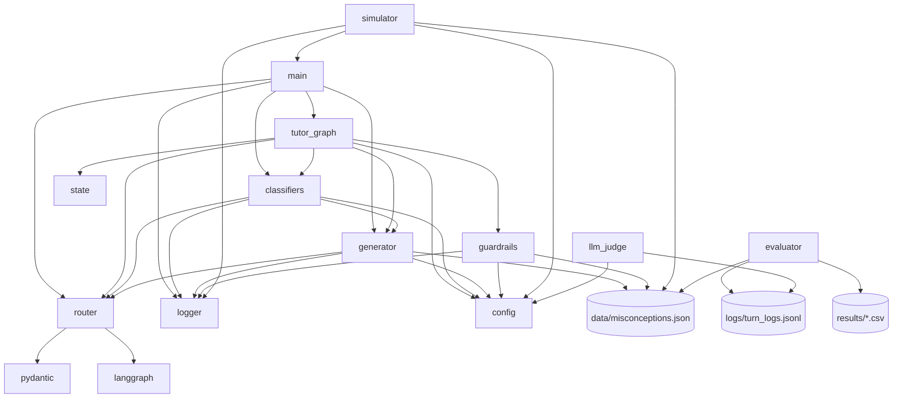
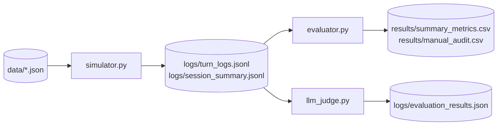

# 7. 依赖与调用关系图

本章用可视化图帮助快速把握“谁依赖谁、运行时如何流动”。图为逻辑视图，实际 import 以源码为准。

## 7.1 运行时主链路（调用图）

```mermaid
flowchart LR
  U[User Input] --> APP[SocraticTutorApp.step/astep]
  APP --> G[LangGraph app_graph]

  G --> C[classify_node]
  C --> NLU[classify_input]
  NLU --> P[PerceptionResult]

  P --> R[route_node]
  R --> FSM[route_state]
  FSM --> D[RouteDecision]
  FSM --> M[SessionMemory]

  D --> GEN[generate_node]
  M --> GEN
  GEN --> GR[generate_reply]
  GR --> OUT[generation(raw_reply/final_reply)]

  OUT --> GUARD[guardrail_node]
  GUARD --> AR[apply_guardrails]
  AR -->|triggered| REGEN[regeneration_required=True]
  REGEN --> GEN
  AR -->|safe| FIN[finalize_node]
  FIN --> LOG[turn/session logging]
```

对应源码：
- `SocraticTutorApp`：[main.py](../../src/main.py)
- 工作流与节点：[tutor_graph.py](../../src/tutor_graph.py)
- NLU：[classifiers.py](../../src/classifiers.py)
- FSM：[router.py](../../src/router.py)
- 生成：[generator.py](../../src/generator.py)
- 护栏：[guardrails.py](../../src/guardrails.py)
- 日志：[logger.py](../../src/logger.py)

## 7.2 模块依赖（import 粗图）



## 7.3 依赖清单
依赖版本在 [requirements.txt](../../requirements.txt)：

- `langgraph`：对话工作流编排与 checkpoint
- `langchain-core` / `langchain-openai`：消息结构 + OpenAI-compatible LLM 客户端
- `pydantic`：结构化输出与数据模型
- `tenacity`：LLM 调用重试
- `ruff` / `pytest`：开发与格式化工具

## 7.4 “运行产物”依赖链



